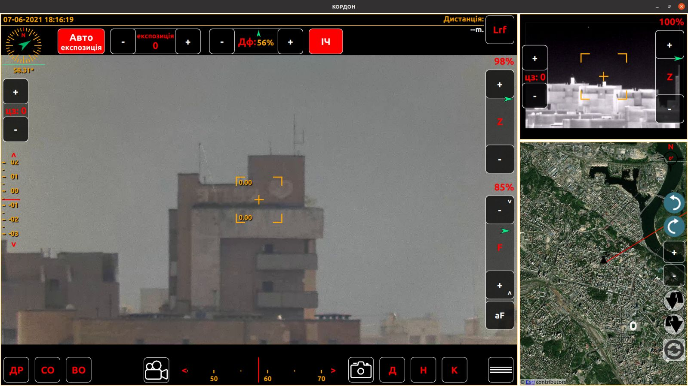
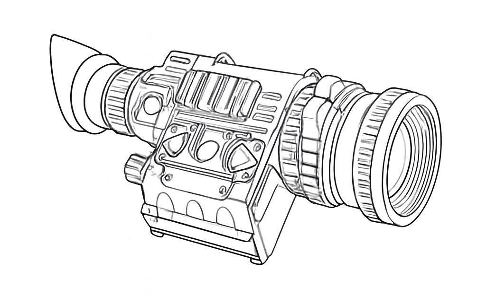
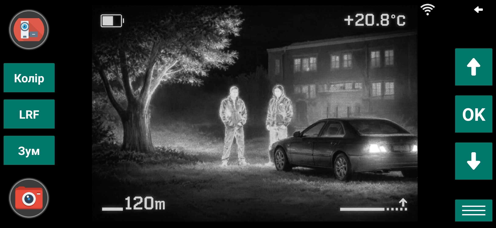
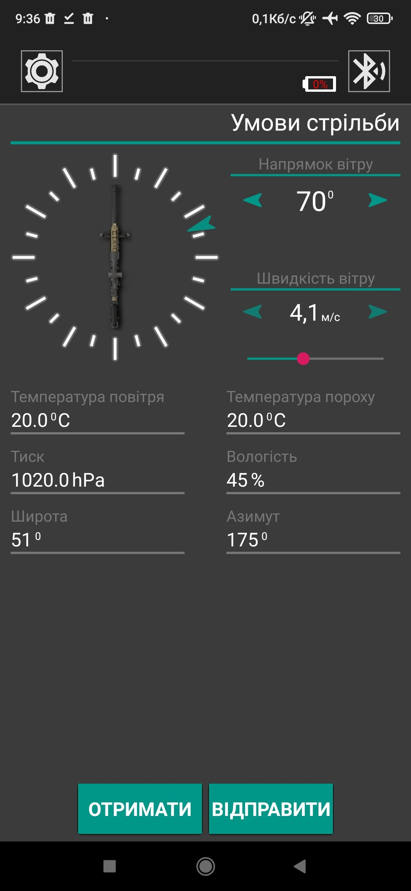
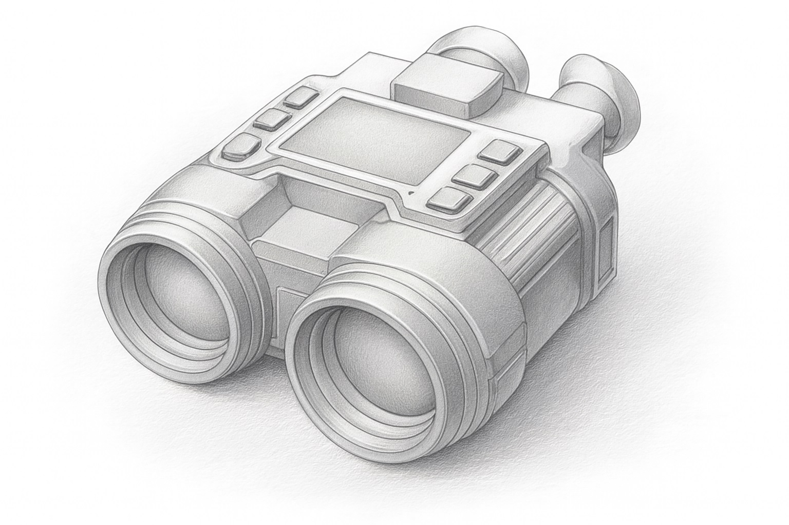
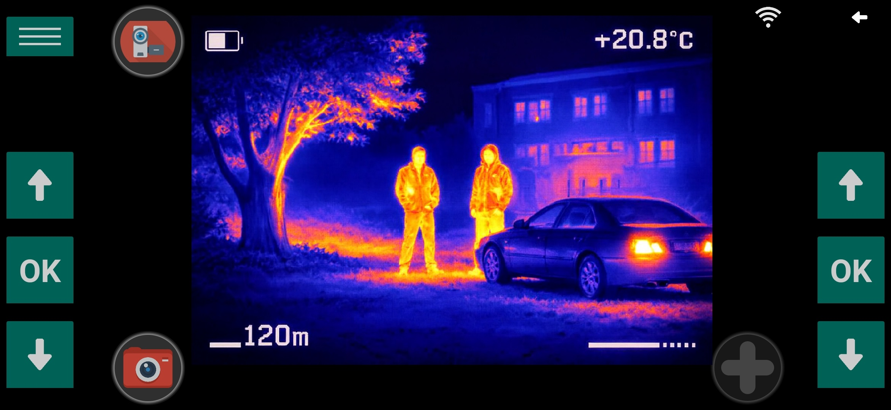

<h2 style="text-align:right; border:none; margin-bottom:0;">
  🌐 <a href="index_ua.html">UA</a>
</h2>

<h1 style="margin-top:0;">
  Aleksandr Deryk
</h1>

<h2 style="border:none; margin-bottom:0;">
  🚀 Portfolio
</h2>
  
* [**BypassNAT (system for remote access to devices)**](#app_4)
* [**CamOnTime (personal media service)**](#app_5)
* [**Optical-electronic thermal imaging video surveillance system**](#app_1)
* [**Ballistic calculator**](#app_2)
* [**Thermal imaging reconnaissance device**](#app_3)
* [**Mean Mole (game)**](#app_6)
* [**IP-cam GO**](#app_7)

---

<h2 id="app_4">
	🧩  <a href="https://in-spectrum.github.io/BypassNAT/" target="_blank">BypassNAT | System for remote access to devices</a>
</h2>

  

**Description**  
Cross-platform system (client/server) for remote control of computers and devices located in networks using NAT.  

Opportunities:
- use of a ***personal*** server to ensure confidentiality;  
- remote device control;  
- file exchange;  
- desktop capture, streaming, and viewing;  
- ssh-tunnel setup, access to devices via ssh protocol.  

Supported platforms: Windows, Ubuntu, ARM (Raspberry Pi), Android  

**Technologies**  
C++, Qt(QML), Multithreading, TCP/IP, 
<a href="https://mediamtx.org/docs/kickoff/introduction" target="_blank">MediaMTX</a>, 
<a href="https://nginx.org/" target="_blank">Nginx</a>, 
<a href="https://gstreamer.freedesktop.org/" target="_blank">GStreamer</a> (RTSP/RTMP-stream)  

<a href="https://github.com/In-spectrum/BypassNAT" target="_blank">GitHub</a>

---

<h2 id="app_5">
	🧩  <a href="https://in-spectrum.github.io/CamOnTime/" target="_blank">CamOnTime | Personal media service</a>
</h2>

  <b>Video preview</b>

  	

**Description**  
Cross-platform ***personal*** multimedia service (client/rtsp-server).  

Opportunities:
- IP cameras registration;  
- viewing live video from IP cameras;  
- saving video on the server;  
- viewing video files;  
- copying video files from server to smartphone;  
- granting access to cameras to other users.  

Supported platforms: Windows, Ubuntu, ARM (Raspberry Pi), Android.  

**Technologies**  
C++, Qt(QML), TCP/IP, 
<a href="https://gstreamer.freedesktop.org/" target="_blank">GStreamer</a> (RTSP-stream, RTSP-server)  

<a href="https://github.com/In-spectrum/CamOnTime" target="_blank">GitHub</a>

---

<h2 id="app_1">🧩 Optical-electronic thermal imaging video surveillance system</h2>

  

  

**Description**  
System designed for video surveillance, both ***day and night***, of terrain and objects at distances over 30 km.  

Opportunities:
- automated observation of defined sectors;  
- laser distance measurement to objects;  
- photo/video recording;  
- automatic object detection and tracking.  

Control is performed via a separate control panel or from a stationary PC/tablet over Ethernet(WiFi).  

**Developed**  
User application for system control on platforms: Windows, Ubuntu, ARM (NVIDIA Jetson TX2), Android.  

**Technologies**  
C++, Qt(QML), Multithreading, TCP/IP, 
online/offline terrain maps EspiMap, 
GPS navigation, Serial-port, Pelco-D, native PTZ control protocol, zoom/focus optical system, 
<a href="https://gstreamer.freedesktop.org/" target="_blank">GStreamer</a> (RTP/RTSP-stream, video recording, screen recording)  

---

<h2 id="app_2">🧩 Ballistic calculator</h2>

  

  

  
  

  

**Description**  
Android application for controlling an optical thermal imaging sight.  

Opportunities:
- viewing current video from the sight on smartphone;  
- recording photo/video files on smartphone;  
- controlling the sight from smartphone;  
- exchanging configuration files (profiles);  
- laser distance measurement to objects;  
- displaying object coordinates on terrain map.  

Control via BluetoothLE, video via WiFi.  

**Developed**  
Application architecture and software. Testing and publishing the app.  

**Technologies**  
Java, Multithreading, TCP/IP, BluetoothLE, 
<a href="https://www.here.com/docs/category/here-sdk-android" target="_blank">HERE Map SDK</a>, 
<a href="https://gstreamer.freedesktop.org/" target="_blank">GStreamer</a> (JPEG-stream, photo and video recording)  

---

<h2 id="app_3">🧩 Thermal imaging reconnaissance device</h2>

  

  

**Description**  
Optical device for reconnaissance using thermal imaging and daytime video channels.  

Opportunities:
- geolocation via GPS or manual coordinate input;  
- laser distance measurement to objects;  
- transmission of current data to network;  
- dual-channel video recording;  
- video streaming via rtsp protocol.  

**Developed**  
Architecture and software for “user menu, OSD”,  
device control using external elements (buttons, joystick)  
for embedded system (HiSilicon platform <a href="https://github.com/openhisilicon/HIVIEW" target="_blank">“HIVIEW-TECH”</a>)  

**Technologies**  
C, Embedded systems, Qt, Multithreading, TCP/IP, 
<a href="https://lvgl.io/" target="_blank">LVGL</a>, 
JSON, I2C  

---

<h2 id="app_6">
	🧩  <a href="https://www.amazon.co.jp/-/en/dp/B0777TMJS3" target="_blank">Mean Mole</a>
</h2>
		

  

  
  

  

**Description**  
Cross-platform game application where the player must overcome obstacles and sow a designated plot of land.  
  
Developed for platforms: Windows, Ubuntu, Android, iOS, Windows Phone.  

**Developed**  
Architecture, logic, and software.  

**Technologies**  
C++, Qt(QML)  

---

<h2 id="app_7">🧩 IP-cam GO</h2>

  
  

  

  

 
  

  

**Description**  
Android application for a multimedia system.  

Opportunities:
- connecting IP cameras to the server;  
- managing and configuring IP cameras on the server;  
- viewing live video from IP cameras;  
- viewing video archive;  
- saving photo/video files on smartphone;  
- payment for services.  

**Developed**  
Logic and software.  

**Technologies**  
Java, Multithreading, REST API  

---
