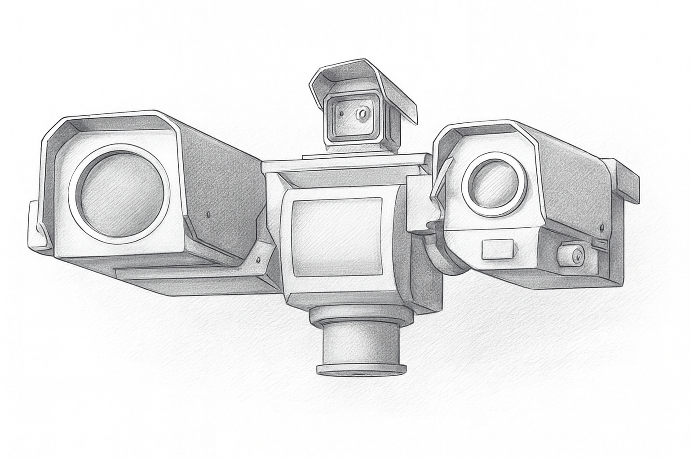
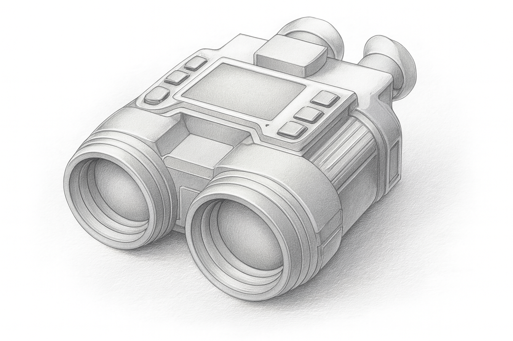
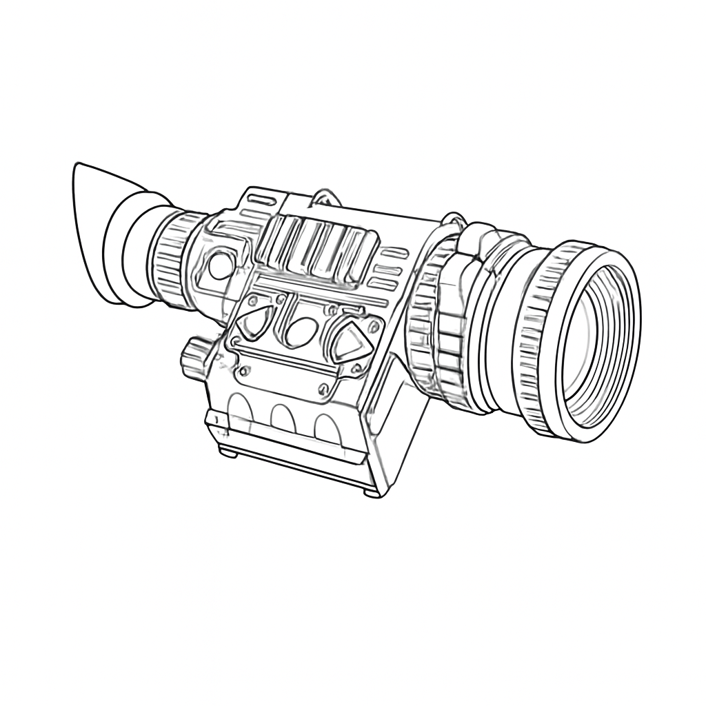

# 🚀 Моє портфоліо

Нижче — приклади розроблених мною додатків.

---

## 🧩 Додаток 1 — Назва

  
  
  

**Короткий опис:**  
Невеликий опис додатку. Яку проблему вирішує, які ключові можливості.

**Технології:**  
`C++` · `Qt` · `GStreamer` · `TCP/IP`

---

## 🧩 Додаток 2 — Назва

  
  

**Короткий опис:**  
Опис другого додатку.

**Технології:**  
`C++` · `Qt` · `OpenCV`

---

## 🧩 Додаток 3 — Назва

  
  

**Короткий опис:**  
Опис третього додатку.

**Технології:**  
`Java` · `Spring` · `PostgreSQL`

---

## 🧩 Додаток 4 — Назва

  
  

**Короткий опис:**  
Опис четвертого додатку.

**Технології:**  
`Python` · `PyQt` · `NumPy`

---

## 🧩 Додаток 5 — Назва

  
  

**Короткий опис:**  
Опис п'ятого додатку.

**Технології:**  
`React` · `TypeScript` · `Node.js`

---

## 🧩 Додаток 6 — Назва

  
  

**Короткий опис:**  
Опис шостого додатку.

**Технології:**  
`C++` · `Qt` · `Multithreading`

---
