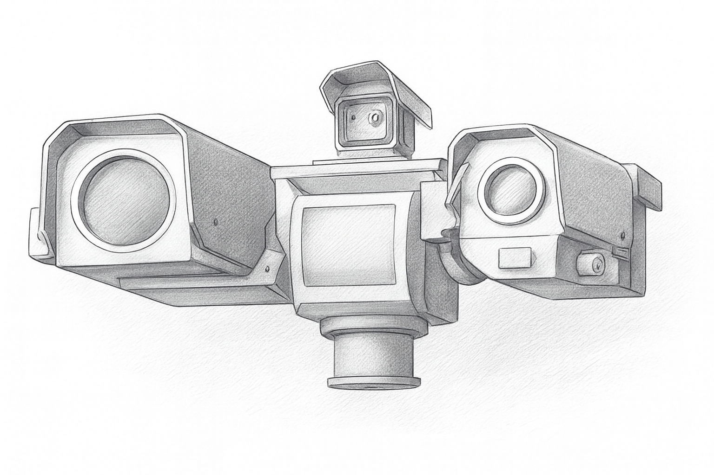
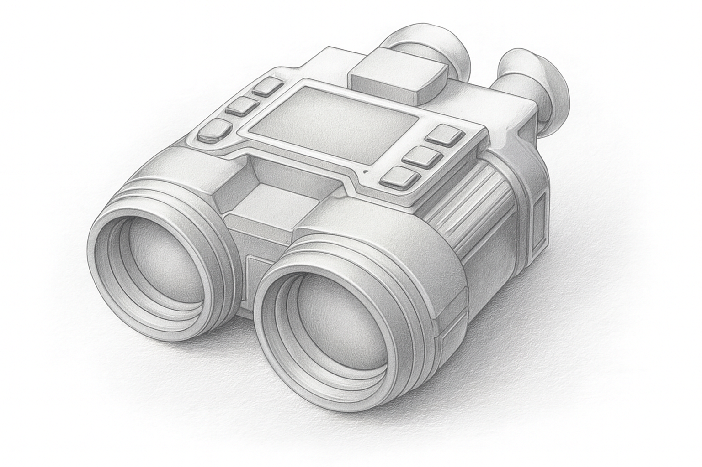
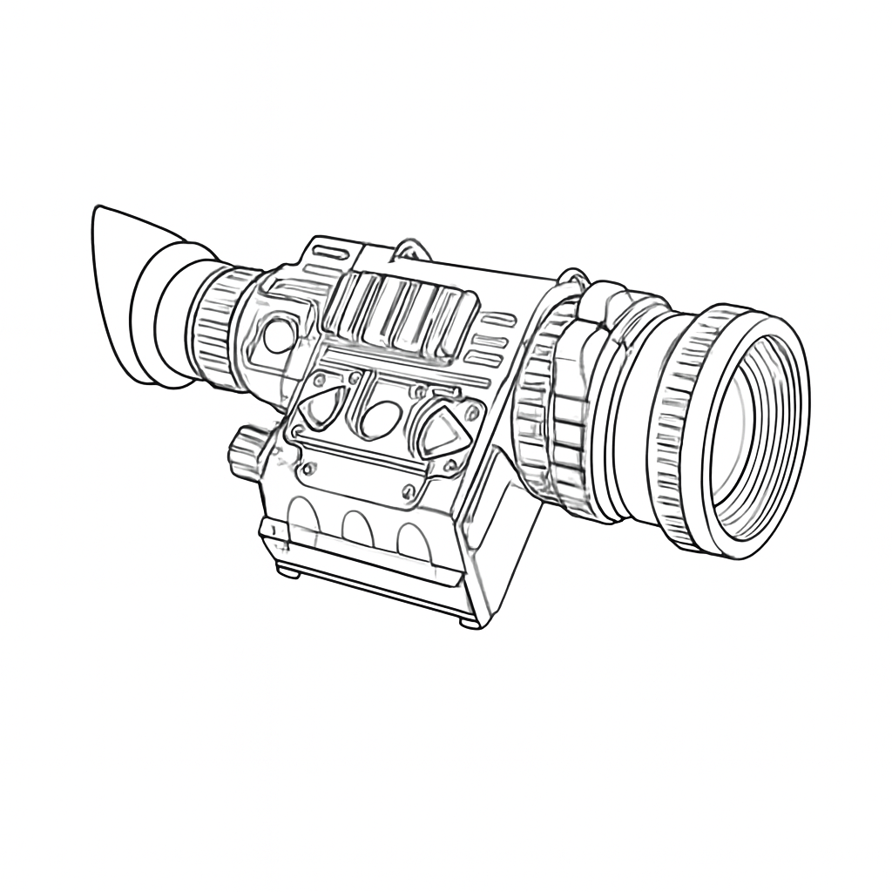

## 🚀 Портфоліо

# Олександр Дерик
---

## 🧩 Оптико-електронна системою відео спостереження

  

  

**Опис:**  
Система призначена для відео спостереження, в ***денний та нічний*** час, за об’єктами, місцевістю на відстанях понад 30км. Забезпечує: автоматизоване спостереження за визначеними секторами, лазерне вимірювання відстані до об’єкта, фото/відео фіксацію, автоматичне виявлення об’єктів та їх супровід. Управління здійснюється за допомогою окремого пульта управлінн або зі стаціонарного ПК, планшета по Ethernet(WiFi) мережі.

**Розробив:**
Додаток користувача для управління системою на платформі: Windows,  Ubuntu, ARM (NVIDIA Jetson TX2), Android.

**Технології:**  
`С++` · `Qt(QML)` · `Multithreading` · `TCP/IP` · `онлай/офлайн карти місцемості EspiMap` · `навігація GPS` · `Serial-port` · `Pelco-D` · `натівний протокол управління поворотною системою` · `зум/фокус оптичної системи` · `GStreamer (RTP/RTSP-stream, запис відео, запис екрана)`

---

## 🧩 Додаток 2 — Назва

  
  

**Короткий опис:**  
Опис другого додатку.

**Технології:**  
`C++` · `Qt` · `OpenCV`

---

## 🧩 Додаток 3 — Назва

  
  

**Короткий опис:**  
Опис третього додатку.

**Технології:**  
`Java` · `Spring` · `PostgreSQL`

---

## 🧩 Додаток 4 — Назва

  
  

**Короткий опис:**  
Опис четвертого додатку.

**Технології:**  
`Python` · `PyQt` · `NumPy`

---

## 🧩 Додаток 5 — Назва

  
  

**Короткий опис:**  
Опис п'ятого додатку.

**Технології:**  
`React` · `TypeScript` · `Node.js`

---

## 🧩 Додаток 6 — Назва

  
  

**Короткий опис:**  
Опис шостого додатку.

**Технології:**  
`C++` · `Qt` · `Multithreading`

---
